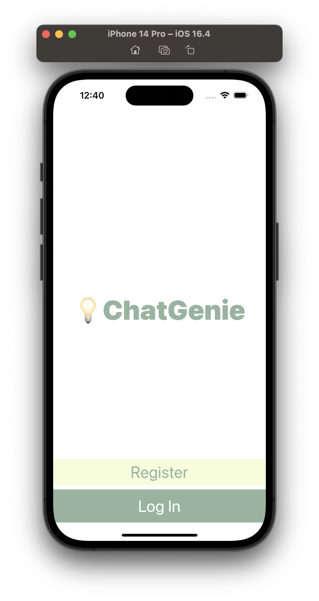
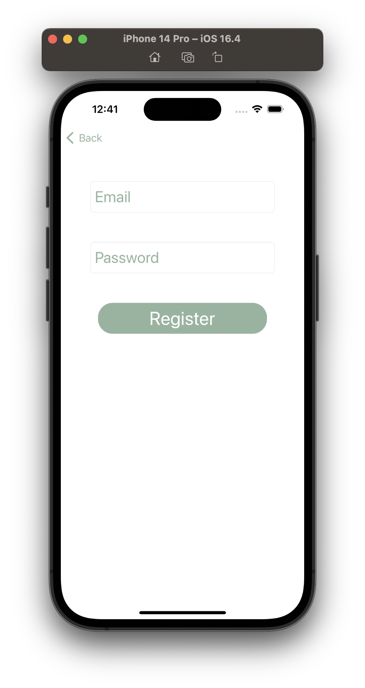
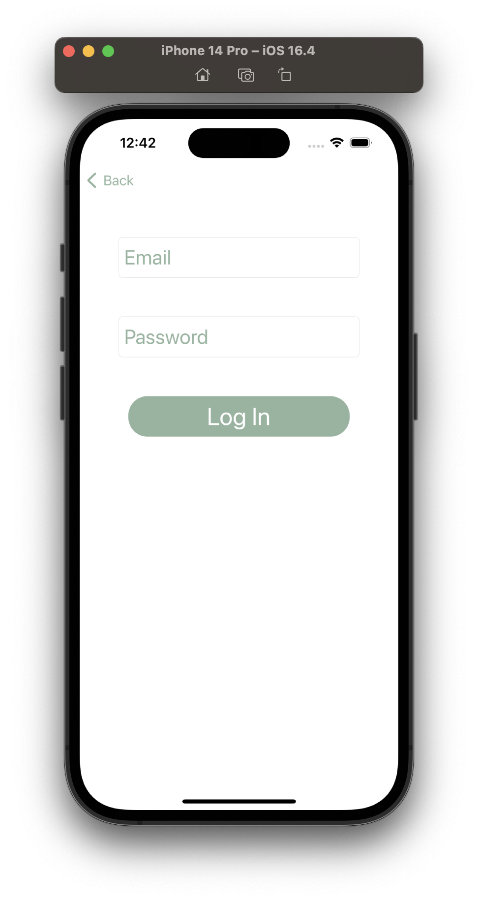
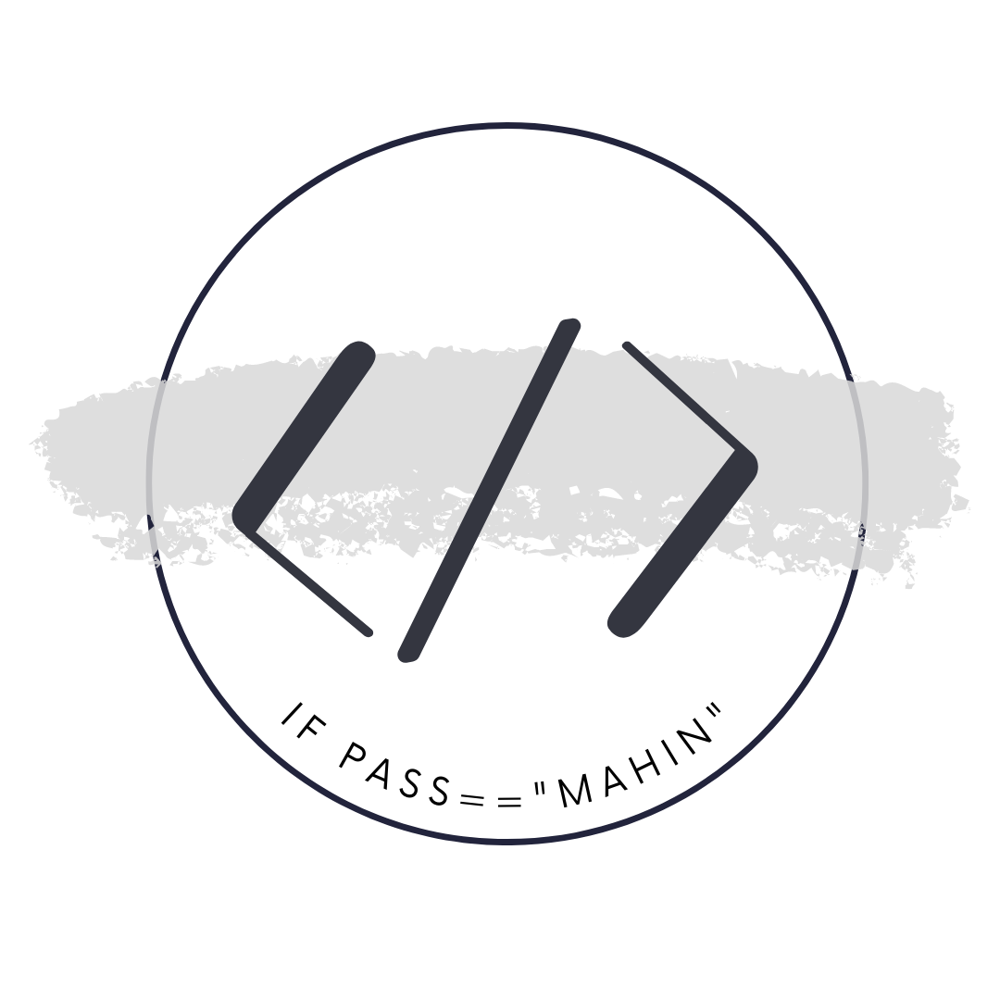

<h1>ChatGenie</h1>
  ChatGenie is an iOS app that lets users chat with an AI. The app includes log in and register functionality with Firebase Auth and also has Firebase Firestore for storing chats. In addition, ChatGenie utilizes third-party libraries such as IQKeyboardManagerSwift and JVFloatLabeledTextField for improved user experience.

<h3>Graphical User Interface</h3>
  <table style="border:none">
    <tr>
        <td></td>
        <td></td>
        <td></td>
        <td></td>
     </tr>
  </table>

<h3>Getting Started</h3>
  To clone this app and run it on Xcode, follow these steps:

<ol>
  <li>Clone the repository: git clone https://github.com/MahinMuhammad/ChatGenie.git</li>
  <li>Open the ChatGenie.xcodeproj file in Xcode.</li>
  <li>Install any required dependencies using CocoaPods or SPM.</li>
  <li>Build and run the project in Xcode.</li>
</ol> 
  
<h3>Features</h3>

<ul>
  <li>Log in and register with Firebase Auth</li>
  <li>Store chat history with Firebase Firestore</li>
  <li>Chat with an AI</li>
  <li>Improved user experience with IQKeyboardManagerSwift and JVFloatLabeledTextField</li>
</ul>   
  
<h3>Future Updates</h3>
  In the next update, I plan to add OpenAI chat completion API for an even more seamless experience.

<h3>Contributing</h3>
  I welcome contributions from the community! To contribute to ChatGenie, follow these steps:

<ol>
  <li>Fork the repository.</li>
  <li>Create a new branch for your feature: git checkout -b feature/your-feature-name.</li>
  <li>Make your changes and commit them: git commit -m "Add your commit message here".</li>
  <li>Push your changes to your forked repository: git push origin feature/your-feature-name.</li>
  <li>Submit a pull request to the main repository.</li>
</ol>
  
<h3>License</h3>
  This project is licensed under the Apache License 2.0 - see the LICENSE file for details.

<h3>Contact</h3>
  If you have any questions or comments about ChatGenie, feel free to reach out to me at rahmanmahin@icloud.com.

<table style="border:none">
  <tr>  
    <td align="center"></h4></td>
  </tr>
  <tr>  
    <td align="center"><h4>Developed by   Md. Mahinur Rahman</h4></td>
  </tr>
</table>
